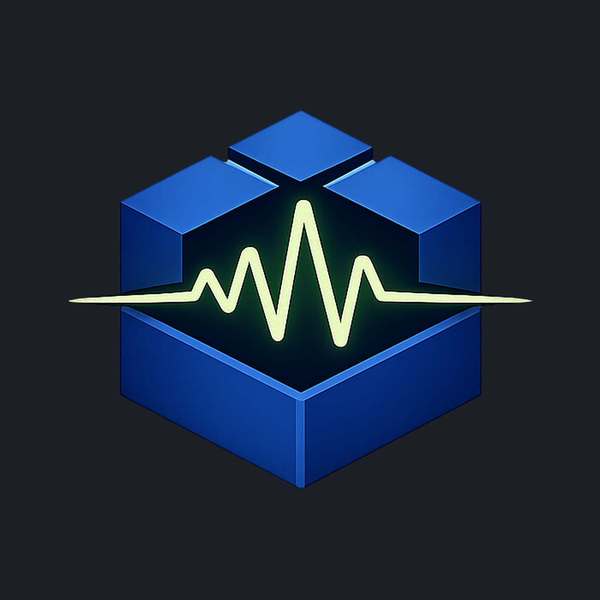

# TrueNAS Pulse

**A native iPhone client for TrueNAS SCALE — built for sysadmins, operators, and homelab users who need fast infrastructure visibility and safe remote remediation away from a browser.**

[Website](https://truenaspulse.com) ·
[App Store](https://apps.apple.com/app/id6759870893) ·
[Features](https://truenaspulse.com/features) ·
[Screenshots](https://truenaspulse.com/screenshots) ·
[Pro](https://truenaspulse.com/pro) ·
[Changelog](https://truenaspulse.com/changelog) ·
[Privacy](https://truenaspulse.com/privacy) ·
[FAQ](https://truenaspulse.com/faq)

---

> **Note**
> This is the public documentation repository for TrueNAS Pulse. The application is closed source — its source code is not published here. This repo holds the public changelog, privacy policy, EULA, terms, and FAQ.

## What it does

TrueNAS Pulse is an independent third-party iPhone client for TrueNAS SCALE. The free tier covers live monitoring, 1-hour history, alerts, storage health, jobs, one proactive monitor, and read-only operational visibility. **TrueNAS Pulse Pro** is a one-time purchase that unlocks the complete operator toolset: fleet view, lifecycle controls, advanced reporting, log streaming, Server Console, and more.

### Free

- Live dashboard with CPU, memory, network, and storage status
- 1-hour reporting history for CPU, memory, and network
- ZFS pool health, disk detail, temperature, and dataset visibility
- Alerts, jobs, services, apps, and VM status — with alert acknowledgement
- One proactive monitor on the active server
- Network interface status and routing overview
- Filesystem browser (read-only) and audit log viewer
- Manual ZFS snapshot creation
- Container lifecycle (TrueNAS 26 native containers)
- Home Screen widget for glanceable server health
- Up to 2 servers with fast server switching

### Pro

- Fleet view and server comparison across every system
- Unlimited proactive monitors across all servers
- Historical reporting graphs (1H · 6H · 24H · 7D · 30D)
- Per-pool storage runway projections
- Live system log streaming
- Disk & VDEV management
- Manual ZFS snapshots (create, delete, clone, rollback)
- Configuration drift comparison
- Service, app, and VM lifecycle controls
- Network editing, share management, and service configuration
- Data protection controls, batch actions, job abort, system update install
- Reboot, shutdown, support bundle, config backup & restore
- Server Console — guarded server access from your phone
- iCloud Sync · Live Activities · Dynamic Island
- Up to 8 servers

> Pro is a **one-time purchase**. No subscription, no recurring charges, no expiry. Localised pricing via App Store.

## Security model

- API tokens stored **exclusively in the iOS Keychain** — never synced to iCloud, never logged.
- Strict TLS validation by default; per-server self-signed certificate opt-in with SHA-256 fingerprint pinning.
- All state-changing actions pass through **Control Mode** — confirmation gate, persistent banner, 5-minute auto-expire.
- High-risk actions (reboot, shutdown, disk wipe, snapshot rollback) additionally require an arming toggle plus biometric authentication.
- No analytics, no telemetry, no third-party SDKs. By default, the app talks only to the TrueNAS servers you configure. The optional Cloud Push Relay (off by default, configured per server) enables background notifications — it never receives API tokens, credentials, passwords, or secrets.
- iCloud Sync (Pro) covers your server list and monitors via your **own private iCloud Key-Value Store** — credentials never travel.
- Local action log — nothing leaves the device.

Read the full [Privacy Policy](https://truenaspulse.com/privacy).

## Requirements

- **iOS:** 17.6 or later (iPhone). Live Activities, Dynamic Island, and Home Screen widgets depend on iOS 17 surfaces.
- **TrueNAS:** SCALE only — version 24.04 and later, including 25.04, 25.10, and 26.x. CORE is not supported.
- **Server access:** the SCALE server must have remote API access enabled. The app uses WebSocket JSON-RPC as the primary transport with REST as a compatibility fallback.

## Built natively for iOS

SwiftUI · WebSocket JSON-RPC · MVVM · iOS Keychain · Strict TLS · Live Activities · Dynamic Island · Home Screen widgets · App Intents. No third-party SDK, no cross-platform runtime — nothing to ship cross-platform.

## Try it without a server

The welcome screen has a **Preview with Sample Data** option that loads the full UI with realistic read-only fixture data. All five tabs are navigable; control actions are visible but disabled. Inside the app, you can also enter Demo Mode anytime via *Settings → Demo → Enter Demo Mode*.

## Beta / TestFlight

A public TestFlight beta is available with upcoming features ahead of App Store releases. The same Free/Pro pricing applies inside the beta. [Join the beta](https://testflight.apple.com/join/r3xzH5eE) or find the link at [truenaspulse.com](https://truenaspulse.com).

## Documentation

Marketing site, walkthrough, and full feature inventory: **[truenaspulse.com](https://truenaspulse.com)**

This repository hosts the public documentation pages served at [legato3.github.io/TrueNAS-Pulse-App](https://legato3.github.io/TrueNAS-Pulse-App/):

| Page | Source | Live |
| --- | --- | --- |
| Changelog | [`docs/changelog.md`](docs/changelog.md) | [truenaspulse.com/changelog](https://truenaspulse.com/changelog) |
| Privacy Policy | [`docs/privacy.md`](docs/privacy.md) | [truenaspulse.com/privacy](https://truenaspulse.com/privacy) |
| EULA | [`docs/eula.md`](docs/eula.md) | [truenaspulse.com/eula](https://truenaspulse.com/eula) |
| Terms of Use | [`docs/terms.md`](docs/terms.md) | [truenaspulse.com/terms](https://truenaspulse.com/terms) |
| FAQ | [`docs/faq.md`](docs/faq.md) | [truenaspulse.com/faq](https://truenaspulse.com/faq) |
| Contact | [`docs/contact.md`](docs/contact.md) | [truenaspulse.com/contact](https://truenaspulse.com/contact) |

## Support

- **Bug reports & feature requests:** [truenaspulse.com/support](https://truenaspulse.com/support)
- **Email:** [support@truenaspulse.com](mailto:support@truenaspulse.com)

When reporting an issue, please include:

- iOS version + device model (Settings → General → About)
- TrueNAS Pulse version (Settings → About)
- TrueNAS SCALE version of the affected server
- Whether the issue reproduces in **Demo Mode** (Settings → Demo → Enter Demo Mode)
- A screenshot or screen recording when relevant

## Trademark and disclaimer

TrueNAS® is a registered trademark of iXsystems, Inc.

TrueNAS Pulse is an independent third-party application and is **not affiliated with, endorsed by, or sponsored by** iXsystems, Inc.

## License

Documentation in this repository is licensed under the terms in [LICENSE](LICENSE).

The TrueNAS Pulse application itself is closed source. Use of the app is governed by the [End User License Agreement](https://truenaspulse.com/eula).

---

© 2026 Christophe Cornelis · One-time purchase · No subscription · No tracking

